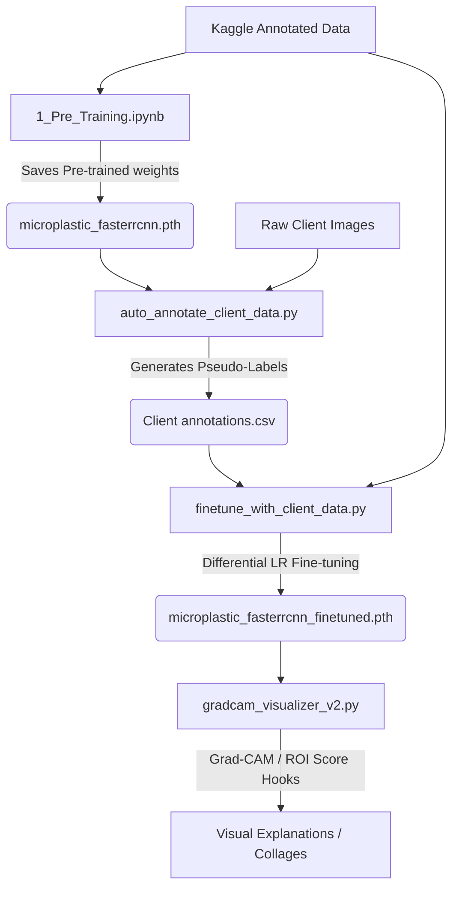

# 🔬 AI-driven Microplastic Detection with Explainable AI (XAI)

This repository contains the complete implementation and analysis pipeline for detecting microplastics in images using a **Faster R-CNN** (ResNet-50-FPN backbone) model, coupled with **Explainable AI (XAI) via Grad-CAM** to visualize and explain model detections.

The pipeline is designed to be run in Google Colab or local environments, enabling the pre-training of a microplastic detector on annotated datasets, auto-annotating new unlabelled client images, fine-tuning the model with mixed datasets, and generating explanatory activation heatmaps.

---

## 📂 Project Structure

```directory
final-code/
├── 1_Pre_Training.ipynb           # Notebook for initial model training on annotated dataset
├── 2_Finetuning.ipynb             # Notebook for auto-annotation and combined domain fine-tuning
├── Result_Figure.ipynb            # Notebook for plotting losses, metrics, and comparisons
├── auto_annotate_client_data.py   # Script to generate pseudo-labels (bounding boxes) on client data
├── finetune_with_client_data.py   # Script for domain-adaptive fine-tuning with differential LRs
├── gradcam_visualizer.py          # Original Grad-CAM explainability visualization script
├── gradcam_visualizer_v2.py       # Updated, client-data-ready Grad-CAM visualizer (with caching)
├── predict_and_gradcam_v1.py      # Inference and basic explanation generation pipeline (v1)
├── predict_and_gradcam_v2.py      # Inference and explainability pipeline with target hooks (v2)
└── log/                           # Training history output directory
    ├── training_history.csv       # Metrics history for the initial training phase
    └── finetune_history.csv       # Metrics history for the fine-tuning phase
```

---

## ⚙️ Core Architecture & Pipeline Phases



### 1. Pre-Training Phase (`1_Pre_Training.ipynb`)
- **Model**: Faster R-CNN with a ResNet-50 backbone and Feature Pyramid Network (FPN).
- **Dataset**: Publicly annotated microplastic datasets (e.g., Kaggle).
- **Hyperparameters**:
  - Epochs: `30`
  - Batch Size: `2`
  - Learning Rate (LR): `0.005` (with momentum `0.9`)
  - Target: Binary Classifier (`1` = Microplastic, `0` = Background)
- **Output**: Trained weights saved to `microplastic_fasterrcnn.pth`.

### 2. Auto-Annotation Phase (`auto_annotate_client_data.py`)
- **Objective**: Leverages the pre-trained model to generate bounding boxes (pseudo-labels) on unannotated client images.
- **Process**:
  - Runs forward inference over images in the raw client data folder.
  - Applies a score threshold (default: `>= 0.35`) to keep robust predictions.
  - Automatically exports labels in a standard bounding box CSV format (`_annotations.csv`) containing `filename`, `width`, `height`, `class`, `xmin`, `ymin`, `xmax`, `ymax`, and confidence `score`.

### 3. Mixed Fine-Tuning Phase (`finetune_with_client_data.py`)
- **Objective**: Adapt the pre-trained detector to the client's custom image domain.
- **Method**: Differential learning rates with two-phase unfreezing:
  - **Phase 1 (Epochs 1-5)**: Freeze the ResNet-50 backbone features; train only the RPN (Region Proposal Network) and ROI heads at a higher learning rate (`0.005`) for rapid domain adjustment.
  - **Phase 2 (Epochs 6-25)**: Unfreeze the backbone layers, applying a lower learning rate (`0.0005`) to preserve general features while adjusting low-level layers to new sensor artifacts.
- **Output**: Saved weights to `microplastic_fasterrcnn_finetuned.pth`.

### 4. Explainable AI (XAI) / Grad-CAM (`gradcam_visualizer_v2.py`)
- **Objective**: Provide visual feedback and explainability for model outputs.
- **Process**:
  - Hooks into the last residual block of the ResNet-50 backbone (`model.backbone.body.layer4[-1]`).
  - Utilizes `pytorch-grad-cam` to map activations corresponding to ROI classifier scores.
  - Produces three visualization outputs:
    1. **Detections**: Bounding boxes overlaid with confidence scores.
    2. **Grad-CAM Heatmap**: Target activation regions highlighting *why* and *where* a microplastic was detected.
    3. **Side-by-side Collage**: The original image, detected boxes, and heatmaps unified for easy reporting.

---

## 📈 Performance & Experimental Results

The metrics below compare the initial training phase with the fine-tuned model variants using the dataset configurations plotted in `Result_Figure.ipynb`:

| Model Configuration | Best Epoch | F1-Score | Precision | Recall | Target Dataset |
| :--- | :---: | :---: | :---: | :---: | :--- |
| **Initial Training** | 15 | **0.7376** | 0.7831 | 0.7318 | Original Kaggle Dataset |
| **Fine-tune (Phase 1)** | 5 | **0.4208** | 0.3863 | 0.6686 | Combined (Backbone Frozen) |
| **Fine-tune (Phase 2) - Run 1** | 20 | **0.6662** | 0.6480 | 0.7319 | Combined (Backbone Unfrozen) |
| **Fine-tune (Phase 2) - Run 2** | 25 | **0.6557** | 0.6225 | 0.7438 | Combined (Backbone Unfrozen) |

### Key Experimental Insights:
1. **Precision-Recall Dynamics**: The initial training model achieves a high precision peak of **0.7831**. Unfreezing the backbone during combined fine-tuning successfully recovers recall (reaching up to **0.7438**) which helps detect faint or domain-displaced microplastic contours in the client's custom imagery.
2. **Backbone Unfreezing Impact**: Unfreezing the backbone (Phase 2) results in a substantial F1-score jump from **0.4208** (Phase 1, Epoch 5) to **0.6662** (Phase 2, Epoch 20).

---

## 🚀 Execution Guide

### Prerequisite Libraries
To set up your python workspace:
```bash
pip install torch torchvision pandas numpy opencv-python-headless pillow matplotlib grad-cam
```

### 1. Step-by-Step Jupyter Execution
- Run `1_Pre_Training.ipynb` to execute the baseline training pipeline.
- Run `2_Finetuning.ipynb` to execute:
  1. Auto-annotations on raw folders.
  2. Differential fine-tuning.
  3. Grad-CAM visualizer comparisons between the pre-trained and fine-tuned model versions.
- Run `Result_Figure.ipynb` to generate the loss comparison plots (`figure1_loss_comparison.png`, `figure2_initial_performance.png`, etc.) shown in publications or slide presentations.

### 2. Standard Command Line Interface (CLI) Execution

#### Auto-Annotation
To auto-annotate client data folder:
```bash
python auto_annotate_client_data.py
```
*(Optionally change paths/folders under configuration block inside the script).*

#### Model Fine-Tuning
To run mixed model fine-tuning:
```bash
python finetune_with_client_data.py
```

#### XAI Visualization
To generate Grad-CAM visual overlays on an arbitrary client image:
```bash
python gradcam_visualizer_v2.py
```
This generates three output images under the default output folder `/outputs/`.
